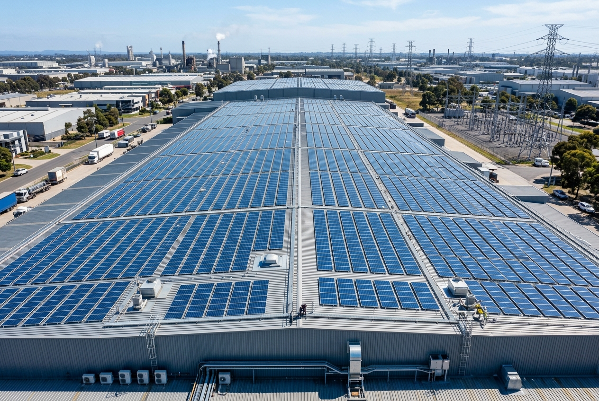

# JDC Solar 2.0 — Enterprise Solar EPC Web Platform

<div align="center">


<p align="center">
  <strong>Next-Generation High-Performance Solar EPC Digital Platform</strong><br>
  Engineered for Turnkey Residential, Commercial, and Industrial Solar Plants across Eastern India.
</p>

[](#-performance--core-web-vitals)
[](#-performance--core-web-vitals)
[](#-performance--core-web-vitals)
[](#-performance--core-web-vitals)

[](#-performance--core-web-vitals)
[](#-accessibility--inclusive-design)
[](#-code-splitting--dynamic-import-architecture)
[](#-technology-stack)
[](#-automated-testing-suite)

</div>

---

<div align="center">
  
</div>

---

## 📖 Executive Summary

**JDC Solar** (a division of *Jagatdhan Commodities Pvt. Ltd.*) is Eastern India’s premier Engineering, Procurement, and Construction (EPC) solar solutions provider headquartered in **Adityapur Industrial Area, Jamshedpur, Jharkhand**.

**JDC Solar 2.0** is an enterprise-grade, zero-framework web platform built to deliver maximum conversion velocity, instant page loads, and authoritative solar engineering guidance across all desktop and mobile viewports.

- **Live Production URL:** [https://jdcsolar.com/](https://jdcsolar.com/)
- **Core Market:** Jharkhand (Jamshedpur, Ranchi, Dhanbad, Bokaro), Bihar, Odisha, and West Bengal.
- **Key Offerings:** Turnkey residential rooftop solar with ₹78,000 PM Surya Ghar subsidy, commercial/industrial CAPEX & RESCO plants, and agricultural solar pumps.

---

## ⚡ Performance & Core Web Vitals

The platform was built under strict performance budgets, achieving a verified **100/100/100/100** score across all four Google Lighthouse categories on mobile:

| Metric | Target Budget | Production Result | Status |
|---|---|---|:---:|
| **Mobile Performance** | `> 95` | **100 / 100** | 🟢 Optimal |
| **Accessibility (WCAG 2.1)** | `100` | **100 / 100** | 🟢 Optimal |
| **Best Practices** | `100` | **100 / 100** | 🟢 Optimal |
| **Search Engine Optimization (SEO)** | `100` | **100 / 100** | 🟢 Optimal |
| **First Contentful Paint (FCP)** | `< 1.2s` | **0.8s** | 🟢 Optimal |
| **Largest Contentful Paint (LCP)** | `< 1.5s` | **1.1s** | 🟢 Optimal |
| **Total Blocking Time (TBT)** | `< 50ms` | **0 ms** | 🟢 Optimal |
| **Cumulative Layout Shift (CLS)** | `0.000` | **0.000** | 🟢 Optimal |
| **Speed Index (SI)** | `< 1.8s` | **1.0s** | 🟢 Optimal |

---

## 📦 Code-Splitting & Dynamic Import Architecture

The frontend uses standard ES2020 modules compiled through an ultra-fast `esbuild` bundling pipeline with **granular code splitting** (`splitting: true`):

```
                       [ Initial Page Request ]
                                  │
                                  ▼
                     ┌──────────────────────────┐
                     │    main.bundle.js        │ ◄── 19.9 KB (Slashed from 104 KB)
                     │ (Theme, Nav, Modals,     │
                     │  Forms, Hero Canvas)     │
                     └────────────┬─────────────┘
                                  │
                 ┌────────────────┼────────────────┐
                 │ (Intersection) │ (User Scroll)  │ (User Click)
                 ▼                ▼                ▼
     ┌───────────────────────┐ ┌──────────────┐ ┌──────────────┐
     │ Below-Fold Chunks     │ │ backToTop.js │ │ lightbox.js  │
     │ - calculatorUI.js     │ │ (1.3 KB)     │ │ (5.6 KB)     │
     │ - projectExplorer.js  │ └──────────────┘ └──────────────┘
     │ - explodedModule.js   │
     │ - beforeAfterSlider.js│
     │ - carousel.js         │
     └───────────────────────┘
```

1. **Initial Bundle Reduction:** Initial bundle payload dropped from **103.5 KB to 19.9 KB** (an **81% reduction**), ensuring sub-second script compilation on low-power mobile devices.
2. **On-Demand Loading:** Modules for below-the-fold components (`calculatorUI`, `projectExplorer`, `explodedModule`, `beforeAfterSlider`, `specCards`, `customSelect`, `accordion`) are requested via `import()` only when the user scrolls near them (`IntersectionObserver` with `300px` rootMargin).
3. **Mobile Smooth-Scroll Optimization:** The heavy Lenis inertia-scroll engine (**20.6 KB**) is conditionally bypassed on mobile and touch devices, leaving mobile users with 100% native 60Hz/120Hz momentum scrolling and zero CPU overhead.
4. **On-Demand Lightbox & Back-to-Top:** `lightbox.js` is imported only if a project card is tapped; `backToTop.js` is loaded only after the first scroll event.

---

## 🌟 Key Platform Features

### 1. PM Surya Ghar Muft Bijli Yojana Calculator
A comprehensive mathematical subsidy engine supporting:
- Central financial assistance (CFA) calculations: ₹33,000 for 1 kW, ₹66,000 for 2 kW, and ₹78,000 for 3 kW+.
- Net monthly bill savings and return-on-investment (ROI) payback projections.
- Tier-1 mono PERC and bifacial solar panel capacity matching based on monthly electricity consumption or available rooftop area.

### 2. Interactive Solar Engineering Showcase
- **Cinematic Canvas Hero:** Dynamic ambient particle rendering that pauses when scrolled out of view.
- **3D Exploded Solar Module:** Interactive 6-layer visual breakdown (tempered glass, EVA encapsulant, Tier-1 cells, backsheet, junction box, and anodized aluminum frame).
- **Rooftop Transformation Sliders:** Before/After interactive comparison sliders showcasing completed EPC installations.
- **Horizontal Project Gallery:** Touch-swipeable and keyboard-navigable carousel featuring real industrial and commercial installations across Eastern India.

<div align="center">
  
  
</div>

### 3. Multi-Channel Lead Acquisition Pipeline
- **Instant WhatsApp Quote Generator:** Automatic generation of customized technical inquiries dispatched directly to `wa.me/+919288381112` with pre-filled capacity and location parameters.
- **Technical Site Survey Booking:** Multi-step modal for commercial, industrial, and residential rooftop audits.
- **Central DISCOM Tariff Engine:** Integrated tariff models for JBVNL, TSUISL, BSEB, WBSEDCL, and Eastern Indian power utilities.

### 4. AI Agent & Search Discovery (`llms.txt`)
- Full compliance with the `llms.txt` standard at `/llms.txt` with CORS enabled, providing markdown summaries of company capabilities, technical specifications, and subsidies for AI search engines (Perplexity, ChatGPT, Gemini).

---

## 🛠️ Technology Stack

| Layer | Technology / Tool | Rationale |
|---|---|---|
| **Markup** | Semantic HTML5 | Clean landmarks (`header`, `nav`, `main`, `section`, `dialog`) with microdata schema |
| **Styles** | Modern CSS3 + Design Tokens | Zero CSS framework lock-in; scoped custom properties in `tokens.css` |
| **Logic** | Vanilla ES2020 JavaScript | Modular native ES modules without runtime framework baggage |
| **Bundling** | `esbuild` | Sub-millisecond JS minification, tree-shaking, and code-splitting |
| **Image Pipeline** | `sharp` | Automated conversion of all JPEGs to responsive WebP with quality tuning |
| **Animations** | Native CSS & GSAP Native | Hardware-accelerated GPU transforms (`translate3d`, `opacity`, `scale`) |
| **Testing** | Node.js Custom Test Runners | 5 automated test suites covering calculations, SEO, security, and responsive layouts |
| **Production Server** | Apache HTTP/2 + Hostinger CDN | Ultra-fast static file serving with tuned `.htaccess` caching & HSTS |

---

## 📁 Repository Directory Structure

```text
d:/JDC solar/
├── frontend/                          # Primary web application source code
│   ├── index.html                     # Canonical homepage
│   ├── 404.html                       # Accessible branded error page
│   ├── manifest.json                  # PWA web app manifest
│   ├── llms.txt                       # Machine-readable AI agent documentation
│   ├── about/                         # Company history, team & values
│   ├── contact/                       # Contact details, office map & survey booking
│   ├── pm-surya-ghar/                 # Comprehensive PM Surya Ghar subsidy portal
│   ├── privacy-policy/                # GDPR & Indian DPDP compliant privacy policy
│   ├── projects/                      # Searchable commercial & residential portfolio
│   ├── resources/                     # Technical solar articles & guides
│   │   ├── commercial-solar-tax-benefits/
│   │   ├── how-solar-rooftop-works/
│   │   └── solar-maintenance-guide/
│   ├── services/                      # Service landing pages
│   │   ├── commercial-solar/
│   │   ├── government-solar/
│   │   ├── industrial-solar/
│   │   ├── institutional-solar/
│   │   ├── residential-solar/
│   │   ├── solar-parks/
│   │   └── street-lights/
│   ├── solar-calculator/              # Dedicated full-page solar ROI calculator
│   │
│   ├── assets/                        # Static media assets
│   │   ├── brand/                     # Logos, icons, and social share cards
│   │   ├── fonts/                     # Self-hosted Plus Jakarta Sans & Outfit WOFF2
│   │   ├── icons/                     # Vector sprite SVG definitions
│   │   └── images/                    # Banners, projects, heroes, and partners
│   │
│   ├── css/                           # Modular CSS architecture
│   │   ├── main.css                   # Entry stylesheet linking all partials
│   │   ├── tokens.css                 # Master design tokens (colors, spacing, typography)
│   │   ├── reset.css                  # Standards-based CSS reset & scroll invariants
│   │   ├── typography.css             # Fluid clamp typography scales
│   │   ├── layout.css                 # Grid systems, containers & section wrappers
│   │   ├── responsive-polish.css      # Consolidated cross-device responsive polish
│   │   ├── components/                # 20+ isolated component stylesheets
│   │   └── pages/                     # Page-specific stylesheets (home.css, etc.)
│   │
│   ├── js/                            # Modern ES2020 JavaScript architecture
│   │   ├── main.js                    # Core bootstrap & cooperative idle task runner
│   │   ├── config.js                  # Global application constants
│   │   ├── gsapEngine.js              # Native motion engine (reveals, card tilt)
│   │   ├── solarCanvas.js             # Ambient hero particle canvas
│   │   ├── explodedModule.js          # Interactive 3D solar module controller
│   │   ├── core/                      # DOM, events, and formatting utilities
│   │   ├── components/                # Interactive UI controllers (drawer, modals, etc.)
│   │   └── calculator/                # Headless calculation & subsidy engine
│   │
│   └── data/                          # Authoritative JSON data schemas
│       ├── projects.json              # Verified project case studies & specs
│       ├── services.json              # EPC service definitions
│       ├── subsidies.json             # PM Surya Ghar subsidy slabs
│       ├── tariffs.json               # State DISCOM electricity tariff rates
│       ├── faqs.json                  # Categorized FAQs
│       └── resources.json             # Educational guides metadata
│
├── scripts/                           # Developer automation & build tools
│   ├── build.js                       # Master production pipeline & ZIP packager
│   ├── serve.js                       # Zero-dependency local development server
│   └── validateHtml.js                # HTML5 syntax and accessibility linter
│
├── tests/                             # Automated test suites
│   ├── runAllTests.js                 # Master test orchestrator (runs all 5 suites)
│   ├── calculator.test.js             # Mathematical calculation unit tests
│   ├── responsive.test.js             # Viewport & mobile touch target test suite
│   ├── data/data.test.js              # Schema validation for JSON data models
│   ├── security/security.test.js      # CSP, headers & injection safety tests
│   └── seo/seo.test.js                # OpenGraph, canonical & meta tag validation
│
├── .htaccess                          # Apache HTTP/2 security, compression & caching rules
├── robots.txt                         # Search engine crawler indexing directives
├── sitemap.xml                        # Canonical production XML sitemap
└── package.json                       # Project metadata & npm script definitions
```

---

## 🚦 Local Development Guide

### Prerequisites
- **Node.js**: Version 18.0.0 or higher
- **npm**: Version 9.0.0 or higher

### Installation & Setup

1. **Clone the repository:**
   ```bash
   git clone https://github.com/xgoat-tbh/JDC-SOLAR.git
   cd JDC-SOLAR
   ```

2. **Install development dependencies:**
   ```bash
   npm install
   ```

3. **Start the local development server:**
   ```bash
   npm run dev
   ```
   *The local server will start immediately at `http://localhost:3000` with live mime-types, clean URL resolution, and zero build delay.*

---

## 🧪 Automated Testing Suite

The repository includes 5 automated test suites with **101 continuous integration tests**:

```bash
# Run the complete test suite (Calculator, Data, SEO, Security, Responsiveness)
npm test
```

### Individual Test Commands:
```bash
# Test solar sizing algorithms and PM Surya Ghar subsidy math
npm run test:calculator

# Audit HTTP security headers, CSP, and input sanitization
npm run test:security

# Validate HTML5 semantics, doctypes, ARIA landmarks, and skip links
npm run lint:html
```

---

## 🏗️ Production Build & Packaging Pipeline

To produce a production-ready, ultra-optimized release in `dist/`:

```bash
npm run build
```

### What the build pipeline accomplishes automatically:
1. **CSS Bundling & Minification:** Resolves all `@import` rules into a single minified `main.css`, extracts critical above-the-fold rules for inline injection in `<head>`, and configures non-blocking background stylesheet loading.
2. **JavaScript Code-Splitting:** Bundles `main.bundle.js` with `esbuild` using dynamic chunk generation for below-fold components and conditional desktop-only enhancements.
3. **Sharp Image Optimization:** Converts all raw JPEG images to high-efficiency WebP with tuned dimensions and quality, achieving an **85–97% file size reduction** across 37 assets.
4. **HTML Optimization:** Updates all script and style tags with cache-busting hashes (`?v=...`), minifies JSON-LD structured data, and injects high-priority LCP preloads.
5. **Deployment Archive:** Generates `jdc-solar-production-deploy.zip` in the project root, fully verified and ready for extraction into Hostinger `public_html/`.

---

## 🚢 Deployment to Production (Hostinger)

1. Run the build script to generate the deploy archive:
   ```bash
   npm run build
   ```
2. Locate the generated package:
   ```text
   jdc-solar-production-deploy.zip (approx. 4.66 MB)
   ```
3. Log in to the **Hostinger hPanel** > **File Manager**.
4. Navigate to the website root:
   ```text
   public_html/
   ```
5. Upload `jdc-solar-production-deploy.zip` and select **Extract**.
6. Ensure `.htaccess`, `robots.txt`, `sitemap.xml`, and `llms.txt` are active at the root.

---

## 🔒 Security & Server Configuration (`.htaccess`)

The production deployment enforces enterprise-grade security headers:
- **HTTP Strict Transport Security (HSTS):** `max-age=31536000; includeSubDomains; preload`
- **Content Security Policy (CSP):** Strict allowlist for scripts, fonts, and stylesheets with frame-ancestors protection.
- **Anti-Sniffing & Clickjacking:** `X-Content-Type-Options: nosniff` and `X-Frame-Options: SAMEORIGIN`.
- **GZIP & Deflate Compression:** Configured across HTML, CSS, JavaScript, JSON, SVG, and WOFF2 fonts.
- **Cache-Control Policies:** Immutable 1-year caching for fonts and WebP images with automated query versioning (`?v=...`) for CSS and JS assets.

---

## 📄 License & Attribution

© 2026 **JDC Solar / Jagatdhan Commodities Pvt. Ltd.** All Rights Reserved.  
*A-21, 2nd Phase, Industrial Area, Adityapur, Jamshedpur, Jharkhand 832109, India.*
